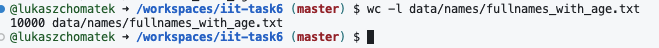
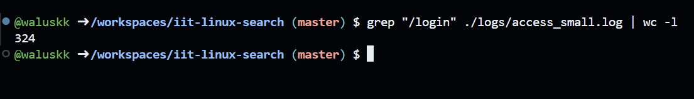
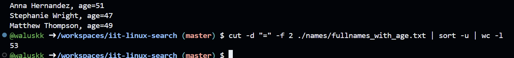
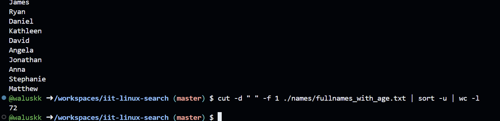
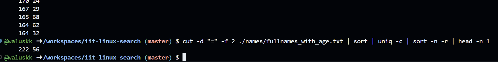
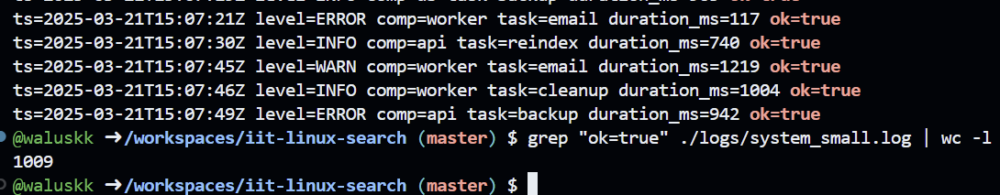
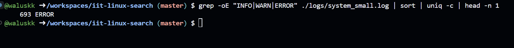
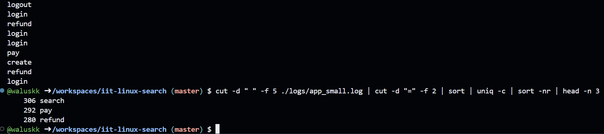
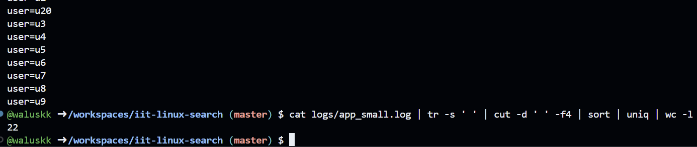

> This is the demonstration how to use Linux commands to process strutured text data.

### 0. How many lines are in fullnames_with_age.txt?

Put screenshot from Codespaces illustrating the result here.
Correct screenshot should contain your github username in the shell, a command and the result.

Example:

**Explanation** Write the explanation why the specific command was used.

Example: wc command is to count data in a given file. -l parameter is for counting lines.

### 1. How many lines in access_small.log have path /login?

**Explanation:**
 grep is used to find the string "/login" in the file
 wc -l is used to count the lines in the output of grep command

---

### 2. How many different ages are in fullnames_with_age.txt?

**Explanation:** 
 cut -d "=" - cut command looks for the char "=" and splits the line there
 -f 2 - cut parameter that specifies the need of the second part of the line (after "=")
 sort -u - sort command sorts the lines (-u means as unique)
 wc -l - wc command counts the lines that have left

---

### 3. How many unique first names are in fullnames_with_age.txt?

**Explanation:**
 cut -d " " - cut command looks for the char " " (in our case space) and splits the line there
 -f 1 - cut parameter that specifies the first part of the line (first space after the name)
 sort -u - sort command sorts the lines (-u unique)
 wc -l - wc command counts the lines that have left
---

### 4. Which age is most frequent in fullnames_with_age.txt?

**Explanation:**
 cut -d "=" - cut command looks for the char "=" and splits the line there
 -f 2 - cut parameter that specifies the second part of the line (after age=)
 sort - groups the similar numbers together
 uniq -c - joins the duplicates together and counts (-c parameter) (uniq only works when the numbers are close together)
 sort -n -r - sorts the lines numerically (-n) in reverse (-r), so the biggest value is at the top
 head -n 1 - gets only the first (-n 1) line (biggest number)

---

### 5. Which username failed login most often in auth_small.csv?

**Explanation:**
 grep "FAIL" - grep command to only get lines with the string "FAIL"
 cut -d "," -f 2 - since this is CSV format, we split the line after the first comma (before name), and we get second field (before another comma)
 *then same commands as before*:
 sort - groups the similar names together
 uniq -c - joins the duplicates together and counts (-c parameter) (uniq only works when the names are close together)
 sort -n -r - sorts the lines numerically (-n) in reverse (-r), so the biggest value is at the top
 head -n 1 - gets only the first (-n 1) line (name with most "FAIL"s)

---

### 6. How many lines in system_small.log have ok=true?

**Explanation:**
 grep "ok=true" - grep command to get lines which contain string "ok=true"
 wc -l - wc command to count the filtered out lines

 *we could also use grep -c which would count the lines in one line"

---

### 7, Which level (INFO, WARN, ERROR) appears most often in system_small.log?

**Explanation:**
 cut -d " " -f 2 - split the line at " " and get the second part
 cut -d "=" -f 2 - split the already split line at "=" (to only get the levels)
 *then the standard pipeline:*
 sort - groups the same error levels together
 uniq -c - joins the duplicates together and counts (-c parameter) (uniq only works when the names are close together)
 sort -nr - sorts the lines numerically in reverse (-nr)
 head -n 1 - gets only the first (-n 1) line (the most appearing error level)

---

### 8. What is the top 3 most common actions in app_small.log?

**Explanation:**
 cut -d " " -f 5 - split the line after the fourth space (fifth part)
 cut -d "=" -f 2 - split the line to get the action
 *then the pipeline:*
 sort - groups the same actions together
 uniq -c - joins the duplicates together and counts (-c parameter)
 sort -nr - sorts the lines numerically in reverse (-nr)
 head -n 3 - shows the 3 values from the top (first 3 with most appearances)

---

### 9. How many unique users are in app_small.log?

**Explanation:**
 cat ... - cat command prints out the whole file into the stream
 tr -s ' ' - tr command squeezes the spaces into a single space
 cut -d ' ' -f 4 - splits the line after the third space (4th part)
 sort - groups the same users together
 uniq - joins the duplicates together
 wc -l - counts the lines

---